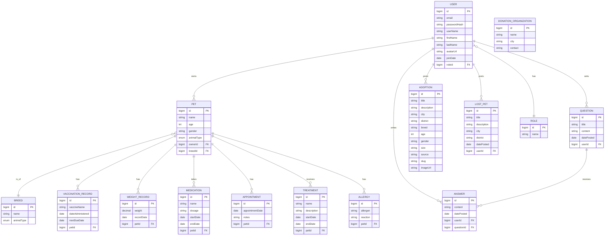

# 🐾 Social Pet Backend

SocialPet, evcil hayvan sahiplerini ve hayvanseverleri aynı platformda buluşturan modern, katmanlı bir Spring Boot REST API backend’idir. Kullanıcılar güvenli bir şekilde kayıt olup (JWT), evcil hayvanlarını yönetebilir, sahiplendirme ilanları oluşturabilir, kayıp ilanları paylaşabilir, soru–cevap akışına katılabilir ve evcil hayvanlarının tıbbi geçmişini (aşı, ilaç, randevu, tedavi, kilo ve alerjiler) tek bir yerde takip edebilir. Dosya yükleme altyapısı görsellerin servislenmesini sağlar. Entegrasyon tarafında Google Places ile yakın çevredeki veteriner klinikleri ve pet shop’lar bulunabilir; yapay zekâ özellikleri kapsamında OpenAI ile kedi cinsi açıklamalı analizi ve TensorFlow modeliyle köpek cinsi tahmini sunulur. Proje, temiz katmanlı mimari (controller → service → repository), DTO/validasyon, stateless JWT güvenlik ve MySQL üzerinde JPA/Hibernate ile çalışır.

### Teknolojiler
- **Dil**: Java 19, Spring Boot 3.3.x
- **Modüller**: Spring Web, Spring Data JPA, Spring Security, Bean Validation
- **Veritabanı**: MySQL (Hibernate/JPA)
- **Kimlik Doğrulama**: JWT (jjwt), BCrypt ile parola hash
- **Diğer**: Lombok, Maven, Multipart file upload, CORS yapılandırması

### Mimari
- **Katmanlar**: `controller` → `service` → `repository` → `entities`
- **Varlıklar (örnek)**: `User`, `Pet`, `Breed`, `Adoption`, `LostPet`, `Vaccination`, `Medication`, `WeightRecord`, `Question`, `Answer`, `DonationOrganization` vb.
- **DTO/Request/Response**: Taşıma nesneleri ile giriş/çıkış ayrımı
- **Güvenlik**: `SecurityConfig` ile stateless JWT, `JwtAuthenticationFilter`, rol bazlı yetkilendirme (örn. `ROLE_ADMIN`)

### Öne Çıkan Özellikler
- **Kullanıcı**: Kayıt ve giriş; JWT üretimi; kullanıcı bilgileri
- **Evcil Hayvan**: CRUD, sahip bazlı listeleme, hayvan türleri (`AnimalType`) endpoint’i
- **Irk ve Irk Analizi**: Irk kayıtları ve tahmin servisi (TensorFlow model dosyaları `src/main/resources/model/`)
- **Sahiplendirme**: İlanlar ve son ilanlar için public endpoint’ler
- **Kayıp İlanları**: Kayıp evcil hayvan duyuruları
- **Tıbbi Kayıtlar**: Aşı, ilaç, kilo, randevu ve tedavi kayıtları
- **Soru–Cevap**: Topluluk soruları ve cevapları
- **Bağış Kuruluşları**: Listeleme ve detay
- **Dosya Yükleme**: Görsel/dosya yükleme ve statik servisleme
- **Google Places**: Mekan arama (API anahtarı ile)

### Entegrasyonlar
- **MySQL**: `spring.datasource.url`, `spring.jpa.hibernate.ddl-auto=update`
- **JWT**: `io.jsonwebtoken` ile token üretimi/doğrulaması
- **Google Places**: `GooglePlacesService` ve `GooglePlacesController`
- **TensorFlow**: `TensorFlowService` + `BreedAnalyzerController` / `DogBreedAnalyzerController` (model: `best_model.h5`, `label_encoder.pkl`, `labels.txt`)
- **OpenAI**: `OpenAIService` tanımlı (anahtar gerektirir)

### Kurulum
1) Java 19 ve Maven kurulu olmalı
2) MySQL’de bir veritabanı oluşturun (örn. `social-pet`)
3) Uygun ortam değişkenlerini ayarlayın (aşağıdaki bölüm)
4) Gerekirse model dosyaları `src/main/resources/model/` altında mevcut

### Ortam Değişkenleri
- `DB_PASSWORD` (zorunlu): MySQL kullanıcı parolası
- `JWT_SECRET` (önerilir): JWT için gizli anahtar
- `GOOGLE_PLACES_API_KEY` (opsiyonel): Google Places entegrasyonu için
- `OPENAI_API_KEY` (opsiyonel): OpenAI servisleri için
- `file.upload-dir`: Yüklenen dosyaların dizini (varsayılan proje içi `uploads/` düşünülerek yapılandırılmalı)
- CORS: `spring.web.cors.allowed-origins` ile istemci domaini

`src/main/resources/application.properties` örnekleri:
```
spring.datasource.url=jdbc:mysql://localhost:3306/social-pet
spring.datasource.username=root
spring.datasource.password=${DB_PASSWORD}
spring.jpa.hibernate.ddl-auto=update
server.port=8080
file.upload-dir=/absolute/path/to/uploads
jwt.secret=${JWT_SECRET}
```

### Çalıştırma
```
mvn spring-boot:run
```
Uygulama varsayılan olarak `http://localhost:8080` üzerinde çalışır.

### Güvenlik
- Stateless JWT ile koruma, `BCryptPasswordEncoder` ile güvenli parola saklama
- Public endpoint’ler: Kimliği doğrulama (`/api/auth/**`), dosya servisleme (`/api/v1/files/**`), bazı public veri uçları (adoption, donation-organizations, breeds, pets vb.)
- Yetki gerektiren örnek: `/api/v1/admin/**` → `ROLE_ADMIN`

### Uç Noktalar (Seçilmişler)

Kimlik Doğrulama – `/api/auth`
- POST `/register` → kullanıcı kaydı, JWT döner
- POST `/login` → e-posta/parola giriş, JWT döner

Kullanıcılar – `/api/v1/users`
- POST `/login` (SecurityConfig’te permitAll)
- POST `/register` (SecurityConfig’te permitAll)

Evcil Hayvanlar – `/api/pets`
- GET `/` → tüm evcil hayvanlar
- GET `/{id}` → tek kayıt
- GET `/owner/{ownerId}` → sahibine göre liste
- POST `/` → oluşturma (DTO validasyonu)
- PUT `/{id}` → güncelleme
- DELETE `/{id}` → silme
- GET `/animal-types` → enum türleri: `code`, `name`

Irklar – `/api/breeds`
- GET `/` → tüm ırklar
- GET `/{id}` → tek ırk
- GET `/by-animal-type/{animalType}` → yol parametresiyle filtre
- GET `?animalType=...` → query parametresiyle filtre (geçersiz türde 400)
- GET `/animal-types` → desteklenen türler
- POST `/` → oluşturma
- PUT `/{id}` → güncelleme
- DELETE `/{id}` → silme

Sahiplendirme – `/api/v1/adoption`
- POST `/create` (multipart) → ilan oluştur (resim opsiyonel)
- POST `/create-json` → JSON ile ilan oluştur
- POST `/{id}/upload-photo` (multipart) → ilana fotoğraf yükle
- GET `/` → tüm ilanlar
- GET `/recent` → son ilanlar (SecurityConfig’te public)
- GET `/{id}` → ilan detay
- GET `/slug/{slug}` → slug ile detay

Kayıp İlanları – `/api/lostpets`
- POST `/{userId}` → kayıp ilanı oluştur (kullanıcı bağlamı)
- GET `/` → tüm ilanlar
- GET `/{id}` → ilan detay
- DELETE `/{id}?userId=...` → kendi ilanını sil

Tıbbi Kayıtlar – `/api/pets/{petId}/medical-records`
- Toplu: GET `/` → pet’e ait tüm kayıtların özeti
- Tedavi: GET `/treatments`, GET `/treatments/{id}`, POST `/treatments`, PUT `/treatments/{id}`, DELETE `/treatments/{id}`
- Aşı: GET `/vaccinations`, GET `/vaccinations/{id}`, POST `/vaccinations`, PUT `/vaccinations/{id}`, DELETE `/vaccinations/{id}`
- Alerji: GET `/allergies`, GET `/allergies/{id}`, POST `/allergies`, PUT `/allergies/{id}`, DELETE `/allergies/{id}`
- Randevu: GET `/appointments`, GET `/appointments/{id}`, POST `/appointments`, PUT `/appointments/{id}`, DELETE `/appointments/{id}`
- Kilo: GET `/weight-records`, GET `/weight-records/{id}`, POST `/weight-records`, PUT `/weight-records/{id}`, DELETE `/weight-records/{id}`
- İlaç: GET `/medications`, GET `/medications/{id}`, POST `/medications`, PUT `/medications/{id}`, DELETE `/medications/{id}`

Soru – Cevap
- Sorular – `/api/questions`: GET `/`, GET `/{id}`, POST `/`, PUT `/{id}`, DELETE `/{id}`
- Cevaplar – `/api/answers`: 
  - POST `/question/{questionId}` → JWT ile cevap oluştur (ROLE_MEMBER/ADMIN)
  - GET `/` → tüm cevaplar
  - GET `/{id}` → tek cevap
  - GET `/question/{questionId}` → soruya göre cevaplar
  - PUT `/{id}` / DELETE `/{id}` → JWT ile kendi cevabını güncelle/sil

Dosyalar – `/api/v1/files`
- GET `/{fileName}` → yüklenen dosyayı servisler (yoksa placeholder)
- POST `/upload` (multipart) → tek dosya yükle; `fileUrl` döner
- POST `/upload-multiple` (multipart) → çoklu dosya yükle

Google Places – `/api/v1/places`
- GET `/test` → entegrasyon health (anahtar maskelenmiş)
- GET `/nearby` → koordinat + `type` ile yakın yerler (varsayılan `veterinary_care`)
- GET `/nearby-by-location` → şehir/ilçe + `type`
- GET `/pet-places` → evcil hayvan odaklı arama (`keyword` opsiyonel)
- GET `/pet-places-by-location` → şehir/ilçe + `keyword`
- GET `/details?placeId=...` → yer detayı
- GET `/autocomplete` ve `/autocomplete-by-location` → öneriler
- GET `/search` ve `/search-by-location` → metin araması
- GET `/search-by-coordinates` → karma kullanım (type/keyword/openNow)

Irk Analizi
- Kedi (OpenAI) – `/api/v1/breed-analyzer/analyze` (multipart: `image`) → açıklamalı analiz sonucu
- Köpek (TensorFlow) – `/api/v1/dog-breed-analyzer/health` → servis durumu
- Köpek (TensorFlow) – `/api/v1/dog-breed-analyzer/analyze-dog` (multipart: `image`) → birincil ırk + skorlar

Bağış Kuruluşları – `/api/v1/donation-organizations` (SecurityConfig’te public)

Yönetim – `/api/v1/admin/**` (ROLE_ADMIN)

Not: Yetkilendirme kuralları `SecurityConfig` altında tanımlıdır; bir kısmı public olarak işaretlenmiştir.


### Veritabanı (ER Diyagramı)


### Entegrasyon Ayrıntıları
- Google Places (Veteriner & Pet Shop): `GooglePlacesController` ile `veterinary_care`, `pet_store` gibi türlerde yakın yer araması; şehir/ilçe bazlı arama; metin araması; fotoğraf çekme ve autocomplete. `GOOGLE_PLACES_API_KEY` zorunludur.
- Kedi Irk Tahmini (OpenAI): `BreedAnalyzerController` → POST `/api/v1/breed-analyzer/analyze` (multipart `image`). `OPENAI_API_KEY` gerekir; görsel içerik analizi ile açıklamalı sonuç üretir.
- Köpek Irk Analizi (TensorFlow): `DogBreedAnalyzerController` → POST `/api/v1/dog-breed-analyzer/analyze-dog` (multipart `image`). Model dosyaları `src/main/resources/model/` altında (`best_model.h5`, `label_encoder.pkl`, `labels.txt`). Yanıt, birincil ırk ve güven skorları gibi alanlar içerir.

### Hızlı cURL Örnekleri
```bash
# Login
curl -s -X POST http://localhost:8080/api/auth/login \
  -H 'Content-Type: application/json' \
  -d '{"email":"test@example.com","password":"secret"}'

# Pet liste
curl -s http://localhost:8080/api/pets

# Kedi ırk analizi (OpenAI)
curl -s -X POST http://localhost:8080/api/v1/breed-analyzer/analyze \
  -H 'Content-Type: multipart/form-data' \
  -F image=@/path/to/cat.jpg

# Köpek ırk analizi (TensorFlow)
curl -s -X POST http://localhost:8080/api/v1/dog-breed-analyzer/analyze-dog \
  -H 'Content-Type: multipart/form-data' \
  -F image=@/path/to/dog.jpg

# Yakın veterinerler (Google Places)
curl -s 'http://localhost:8080/api/v1/places/nearby?latitude=41.0&longitude=29.0&radius=3000&type=veterinary_care'
```

Spring Boot tabanlı evcil hayvan sosyal platformu backend API'si.

## 🚀 Hızlı Başlangıç

### 1. Gereksinimler
- Java 17+
- Maven 3.6+
- MySQL 8.0+
- OpenAI API Key (GPT-4 Vision için kedi türü analizi)
- Google Places API Key

### 2. Environment Variables Setup

Güvenlik için API key'leri environment variable olarak kullanılır:

```bash
export OPENAI_API_KEY="your_openai_api_key_here"
export GOOGLE_PLACES_API_KEY="YOUR_GOOGLE_PLACES_API_KEY_HERE"
```

**ÖNERİLEN: .env dosyası kullanın** (proje kök dizininde):
```
OPENAI_API_KEY=your_openai_api_key_here
GOOGLE_PLACES_API_KEY=your_google_places_api_key_here
```

### 3. Projeyi Çalıştırma

```bash
# Dependency'leri yükle
./mvnw clean install

# Uygulamayı başlat
./mvnw spring-boot:run
```

### 4. API Test

```bash
# Health check
curl http://localhost:8080/api/v1/places/test

# Pet ekleme
curl -X POST http://localhost:8080/api/pets \
  -H "Content-Type: application/json" \
  -d '{
    "name": "Buddy",
    "age": 3,
    "gender": "Male",
    "animalType": "DOG",
    "ownerId": 1,
    "breedId": 1
  }'

# Kedi türü analizi (OpenAI GPT-4 Vision)
curl -X POST http://localhost:8080/api/v1/breed-analyzer/analyze \
  -F "image=@path/to/cat/image.jpg"
```


